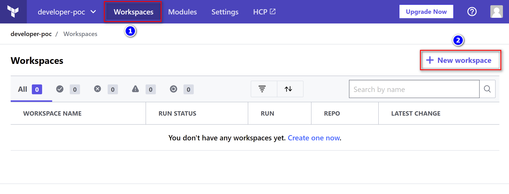
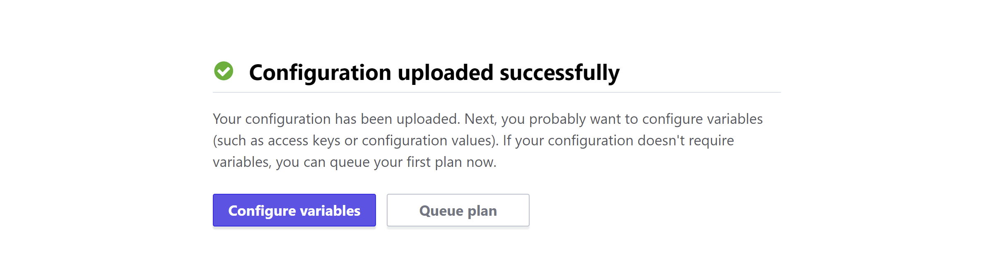
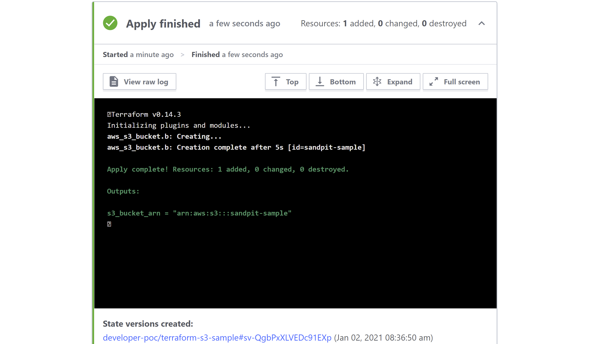
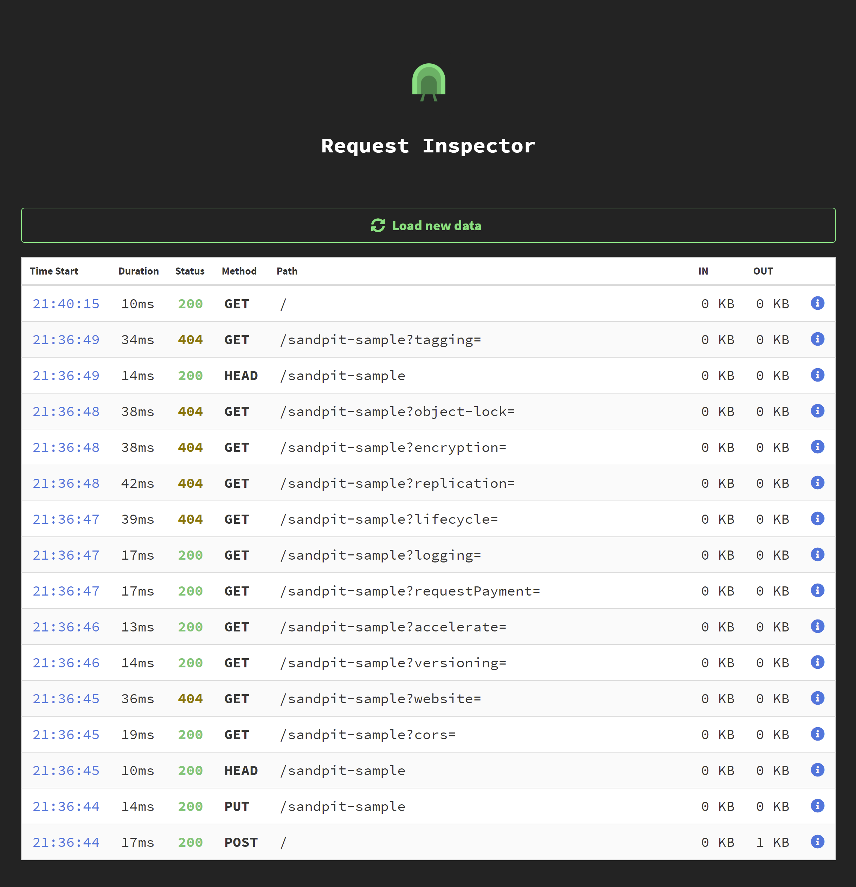

# Localhost Tunnelling to Access Localstack from Terraform Cloud

This repo contains sample code for provisioning an S3 bucket on an AWS [Localstack](https://github.com/localstack/localstack) instance from a Terraform Cloud workspace via localhost tunnelling. The instructions which follow outline the requirements for replicating the set up.

Tunnelling is established by using [tunnelto](https://tunnelto.dev/) to expose Localstack on a public URL. 

Refer to the `tunnelto` [official webpage](https://tunnelto.dev/) and [git repo](https://github.com/agrinman/tunnelto) for project details.

## Expose Localstack via Public URL

Download and install `tunnelto` from either the [official webpage](https://tunnelto.dev/) or [git repo](https://github.com/agrinman/tunnelto), e.g. for installation to target path `/usr/bin/local` on a Linux platform:

```
$ wget https://github.com/agrinman/tunnelto/releases/download/<VERSION>/tunnelto-linux.tar.gz

$ chmod 755 tunnelto
$ sudo cp tunnelto /usr/local/bin
```

Ensure the latest release of [Localstack](https://github.com/localstack/localstack#installing) is running. The latest version enables access to the AWS services via a [single EDGE port (default 4566)](https://github.com/localstack/localstack#configurations) as opposed to older versions where each service was assigned a dedicated port.

The following example establishes a tunnel with subdomain `uniquelocalstack`. When choosing your subdomain name, aim for something meaningful and likely to be unique for your use case. Common or generic names may already be allocated.

```
$ tunnelto --port 4566 --subdomain uniquelocalstack
```

This should return a public URL and a Local Inspector Dashboard address, for monitoring incoming requests.

```
⣷ Success! Remote tunnel created on: 

https://uniquelocalstack.tunnelto.dev

=> Forwarding to localhost:4566

Local Inspect Dashboard: http://localhost:38047
```

From the output for our example above, the Localstack public URL (`<TUNNEL URL>`) is 

`https://uniquelocalstack.tunnelto.dev` with corresponding Dashboard address of `http://localhost:38047`.

You should now be able to make requests to the AWS services using the public address. For example, to access using the AWS CLI, specify your public address as the value for option `--endpoint-url`:

```
$ aws --profile localstack --endpoint-url <TUNNEL URL> s3 ls
```

# Terraform Cloud Workspace

## Prerequisites

* Signup for a Cloud account at [Terraform Cloud - Signup](https://app.terraform.io/signup/account)

* Copy this repo to your git account to run the example for creation of an S3 bucket on your Localstack instance

## Configure Terraform AWS Provider

Edit details in `main.tf` to use [Localstack as the AWS provider](https://registry.terraform.io/providers/hashicorp/aws/latest/docs/guides/custom-service-endpoints#localstack) by substituting <TUNNEL URL> with your Localstack public URL

- *main.tf*

  ```
  provider "aws" {
    ...
    ...
    ...
    endpoints {
      acm            = "https://<TUNNEL URL>"
      apigateway     = "https://<TUNNEL URL>"
      cloudformation = "https://<TUNNEL URL>"
      cloudwatch     = "https://<TUNNEL URL>"
      dynamodb       = "https://<TUNNEL URL>"
      ec2            = "https://<TUNNEL URL>"
      es             = "https://<TUNNEL URL>"
      firehose       = "https://<TUNNEL URL>"
      iam            = "https://<TUNNEL URL>"
      kinesis        = "https://<TUNNEL URL>"
      kms            = "https://<TUNNEL URL>"
      lambda         = "https://<TUNNEL URL>"
      rds            = "https://<TUNNEL URL>"
      route53        = "https://<TUNNEL URL>"
      s3             = "https://<TUNNEL URL>"
      secretsmanager = "https://<TUNNEL URL>"
      ses            = "https://<TUNNEL URL>"
      sns            = "https://<TUNNEL URL>"
      sqs            = "https://<TUNNEL URL>"
      ssm            = "https://<TUNNEL URL>"
      stepfunctions  = "https://<TUNNEL URL>"
      sts            = "https://<TUNNEL URL>"
    }
  }
  ...
  ...
  ```


## Create Workspace

Now that our Terraform code is configured to use the tunnel, we can go back to Terraform Cloud and start setting up a cloud workspace.

* Create a new workspace by choosing `Workspaces --> New Workspace`



* Choose `Version control workflow` when prompted for the workflow type
* For the VCS (Version control provider/source), choose `github.com`


* You will be prompted to authenticate with your Github account in order to access your repositories
* Once authentication completes, choose the repo `terraform-cloud-localstack`
* The `workspace name` defaults to `terraform-cloud-localstack`
* Select `create workspace` to trigger the workspace creation/configuration



## Execute the Terraform Plan

* Run the plan by selecting `Queue plan`
* Respond to the `Confirm and Apply` prompt by adding in a comment
* Finally, choose `Confirm Plan`
* Once the Terraform plan has executed successfully, you'll be able to view the logs and State versions



## Verifying Deployment of Plan Components

* To confirm the bucket has been created on the Localstack instance we use either the localhost AWS endpoint URL,

```
$ aws --profile localstack --endpoint-url http://localhost:4566 s3 ls

2021-01-02 08:36:44 sandpit-sample
```

or by using the public address associated with your tunnel:

```
$ aws --profile localstack --endpoint-url <TUNNEL URL> s3 ls

2021-01-02 08:36:44 sandpit-sample
```

* The  Local Inspector Dashboard, as noted earlier, should show the incoming requests from the public address

* Below is sample output for the example used earlier, as it appears at Dashboard URL: `http://localhost:38047`



* Subsequent changes to code within the git repository will automatically be reflect in the Cloud workspace